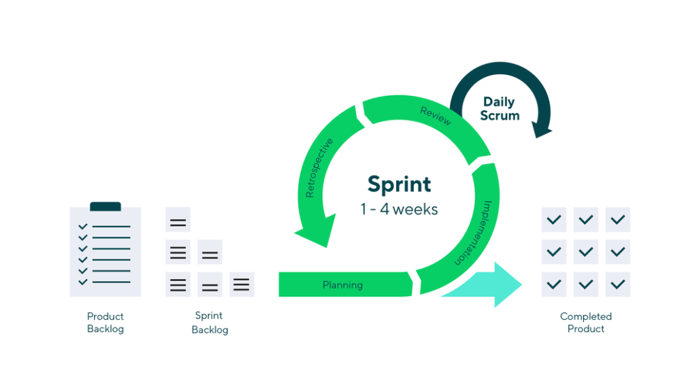

<h1 align="center"> Proyecto-SUBWAY </h1>

## Menú de Navegación
A continuación se lista el contenido de este archivo, seleccione una opción del listado para dirigirse al contenido.

- [Objetivos del Proyecto](#objetivos-del-proyecto)
- [Alcance del Proyecto](#alcance-del-proyecto)
- [Stack Tecnológico](#Stack-tecnologico)
- [Dashboard](#dashboard)
- [Metodología](#metodología)
- [Cloud - Guía General](#cloud---guía-general)
- [Deploy en Streamlit](#deploy-en-streamlit)
- [Análisis Exploratorio de Datos (EDA)](#análisis-exploratorio-de-datos-eda)
- [Diagrama de Entidad-Relación (ERD)](#diagrama-de-entidad-relación-erd)
- [Diccionario](#diccionario-de-datos)
- [Modelo de Recomendación de Machine Learning](#modelo-de-recomendación-de-machine-learning)
- [Colaboradores](#Equipo-Data-Studio18)
- [Video](#video)

TECNOLOGIAS:

## Objetivos del Proyecto

Somos "DATASTUDIO18" una consultora de datos especializada en ofrecer soluciones estratégicas personalizadas para empresas en diversos sectores. Nuestra experiencia abarca análisis de mercado, con un enfoque particular en las necesidades y requerimientos de los usuarios. Nuestro compromiso es impulsar el crecimiento y la eficiencia, utilizando herramientas avanzadas de análisis de datos y Machine Learning. ”
nuestro objetivo con nuestro cliente
es Mejorar la calidad de servicio y la satisfacción de clientes de Subway a través del análisis de los reviews en Google Maps y Yelp con el uso de herramientas de Data Science, Análisis de sentimiento y Machine Learning.

## Alcance del Proyecto
El proyecto abarcará el proceso ETL y el Análisis Exploratorio de Datos (EDA), considerando la integración de información proveniente de Yelp y Google Maps. Se utilizarán herramientas como Streamlit. El modelo de recomendación de Machine Learning incorporará análisis de sentimientos, técnicas de procesamiento de lenguaje natural (NLP) y considerará restaurantes de las cadenas  de SUBWAY de los  estados de Nueva York , Pensilvania y Florida para mejorar la calidad  del servicio y aumentar las ventas.

### Key Performance Indicators

<!DOCTYPE html>
<html lang="es">
<head>
    <meta charset="UTF-8">
    <meta name="viewport" content="width=device-width, initial-scale=1.0">
 
</head>
<body>
    <h2>Tabla de objetivos KPI</h2>
    <table>
        <tr>
            <th>KPI</th>
            <th>Objetivo</th>
        </tr>
        <tr>
            <td>Aumentar un 20% la cantidad de reseñas positivas del trimestre actual respecto al trimestre anterior.</td>
            <td>Aumentar las reseñas positivas en un 20%.</td>
        </tr>
        <tr>
            <td>Aumentar en un 10% la cantidad de reseñas del trimestre actual respecto al trimestre anterior.</td>
            <td>Aumentar la cantidad de reseñas en un 10%.</td>
        </tr>
        <tr>
            <td>Aumentar en 0.3 puntos el promedio trimestral de puntuación según el promedio del trimestre anterior</td>
            <td>Aumentar el promedio de puntuación en 0.3 puntos.</td>
        </tr>
        <tr>
            <td>Disminuir en 10% las reseñas negativas relacionadas con las formas de pago del trimestre actual con el anterior</td>
            <td>Disminuir las reseñas negativas relacionadas con las formas de pago en un 10%.</td>
        </tr>
        <tr>
            <td>Aumentar en 10% las reseñas positivas relacionadas con las formas de servicio/atención del trimestre actual con el anterior</td>
            <td>Aumentar las reseñas positivas relacionadas con las formas de servicio/atención en un 10%.</td>
        </tr>
    </table>
</body>
</html>

---

## Dashboard

[Power-BI-Link](https://acortar.link/Sw1dil)

---

## Metodología

El proyecto seguirá la metodología Scrum para la gestión y desarrollo de los avances. El flujo que se sigue para la continuidad del proyecto bajo esta metodología se muestra en la siguiente imagen.

Las reuniones que se desarrollaron a lo largo del proyecto son las siguientes:

* Reunión diaria del equipo (Daily Standup Meetings) 
* Reunión de revisión del Sprit (Sprint Review Meetings)

## Diagrama de Entidad-Relación (ERD)

Para visualizar la estructura de la base de datos utilizada en este proyecto, se creó un Diagrama de Entidad-Relación (DER).diagrama en formato PDF: [Diagrama entidad-relación](https://github.com/cesagarcia1984/proyecto_Subway/blob/main/Imagen/entidad%20relacion.png).

# Deploy del Modelo de recomendación - ML

https://proyectosubwaydatastudio18.streamlit.app/Introduccion

## Equipo Data Studio18

<table>
  <thead>
    <tr>
      <th>Nombre</th>
      <th>Correo electrónico</th>
      <th>Rol</th>
      <th>LinkedIn</th>
    </tr>
  </thead>
  <tbody>
    <tr>
      <td>Cesar Garcia</td>
      <td>Gorotrader84@gmail.com</td>
      <td>Data Engineer | Machine Learning Engineer</td>
      <td></td>
    </tr>
    <tr>
      <td>Florencia Sandoval</td>
      <td>florenciasandoval1993@gmail.com</td>
      <td>Machine Learning Engineer | Data Analyst</td>
      <td></td>
    </tr>
    <tr>
      <td>Anabel Jimenez</td>
      <td>Anabeljimenezh19@gmail.com</td>
      <td>Data Engineer | Data Science</td>
      <td></td>
    </tr>
    <tr>
      <td>Blas Fernando Pacios</td>
      <td>blasferp@gmail.com</td>
      <td>Data Science | Data Analyst</td>
      <td></td>
    </tr>
  </tbody>
</table>

# Video explicativo
Enlace al video: https://www.youtube.com/watch?v=bjpfoonK5ZA

